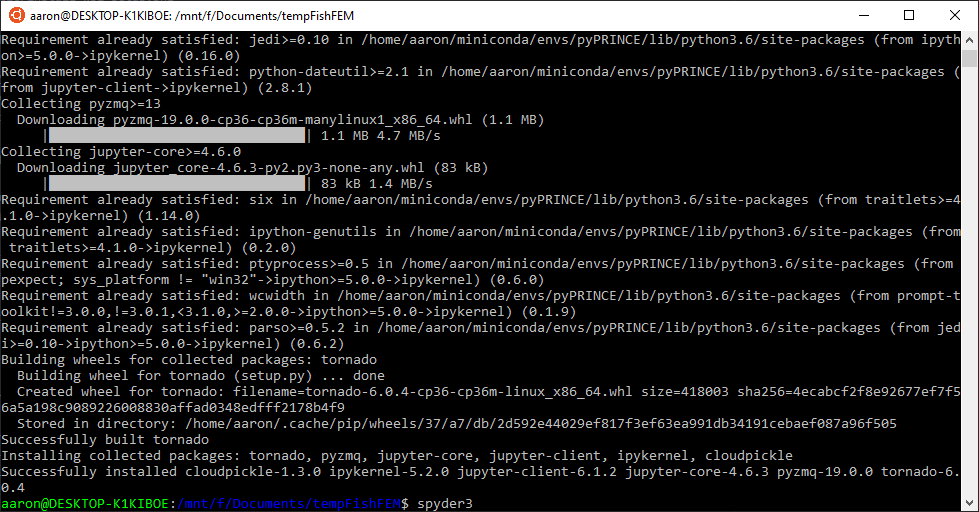

Installation
============

.. _linux-install:

Linux and MacOS
---------------

gmsh
****

fish2eod requires *gmsh* to run, and requires **specifically version 3.0.6**

Ubuntu
++++++

If you're on version 18.04 you can install gmsh with

.. code-block:: bash

    sudo apt-get install gmsh

Otherwise you can download it from `here <https://gmsh.info/bin/Linux/>`__.

MacOS
+++++

If you're on a mac you can download and install it from `here <http://gmsh.info/bin/MacOSX/>`__. or you can run the
following

.. code-block:: bash

    wget http://gmsh.info/bin/MacOSX/gmsh-3.0.6-MacOSX.dmg -O gmsh.dmg
    sudo hdiutil attach gmsh.dmg
    sudo cp -R /Volumes/gmsh-3.0.6-MacOSX/Gmsh.app /Applications
    sudo hdiutil unmount /Volumes/gmsh-3.0.6-MacOSX

fish2eod
********

The reccomended way to install fish2eod is through conda. If you do not already have a version of conda installed you
can download and install is from `here <https://docs.conda.io/en/latest/miniconda.html>`__.

Assuming you do not have an existing environment you want to use you'd do the following. Where *my_envionment_name* is
what you'd want to call your environment and *v* is the python version you want. fish2eod is currently tested and
supported on 3.7, 3.8, and 3.9

.. code-block:: bash

    conda create -n my_environment_name python=v
    conda activate my_environment_name
    conda install -c conda-forge fish2eod

If you already have an environment you want to use you can just install fish2eod

.. code-block:: bash

    conda install -c conda-forge fish2eod

Windows
-------

fish2eod is not formally supported on windows, due to docker no longer being supported on non-professional versions of
windows we have elected not to ship docker images. If you want to install fish2eod on windows you can either install a
linux or mac VM (see linux or mac instructions) or use the microsoft WSL (windows subsystem from linux), note this has
only been tested on Windows 10.

To install wsl see the instructions `here <https://docs.microsoft.com/en-us/windows/wsl/install-win10>`__ and make sure
you initialize your distribution (see instructions
`here <https://docs.microsoft.com/en-us/windows/wsl/initialize-distro>`_).

.. image:: _static/install_wsl_setup.png

Once installed fish2eod can be installed by following the :ref:`Linux instructions <linux-install>`.

At this point fish2eod is installed, however if you want to use a proper editor (ide) to develop models on this is a
challenge. To get this to work, you need an editor familiar with WSL and you need an editor capable of setting
environment variables.

There are two options.

#. Installing an IDE within WSL
#. Routing the WSL interpreter to a windows ide.

For both of these options you'll need to install an x-windows emulator such as
`x-ming <https://sourceforge.net/projects/xming/>`_

Installing IDE WSL
******************

For this we'll install spyder3.

.. code-block:: bash

   sudo apt install spyder3

Like before you'll be prompted to answer ``Y``

Before starting Spyder for the first time we need to add a few packages

.. code-block:: bash

   conda activate fish2eod
   pip install ipykernel cloudpickle

We can start spyder with

.. code-block:: bash

   spyder3

To add the interpreter we'll do the following

.. image:: _static/spyder_config_1.png
.. image:: _static/spyder_config_2.png
.. image:: _static/spyder_config_3.png
.. image:: _static/spyder_config_4.png

Routing Interpreter
*******************

The only editor I know of that supports this is `PyCharm professional <https://www.jetbrains.com/pycharm/>`__  free for
students.

To be clear this is a filthy, filthy, filthy dirty hack currently works - it may not work in the future. Please raise an
issue if this is the case.

First you have to set two environment variables in windows

.. code-block:: bash

   WSLENV = PKG_CONFIG_PATH/u
   PKG_CONFIG_PATH = /home/your_user_name/miniconda/envs/fish2eod/lib/pkgconfig

.. image:: _static/env1.png

.. image:: _static/env3.png
.. image:: _static/env4.png

Of course if your conda path is different or you're using a different environment name these must be changed

Now restart your computer.

To add the interpreter to pyCharm (for instructions see
`here <https://www.jetbrains.com/help/pycharm/using-wsl-as-a-remote-interpreter.html#configure-wsl>`__). Add add the
appropriate path

.. image:: _static/pycharm2.png

Lastly for each project you'll have to configure the display variable.

And disable scientific mode (it may be unset to begin with then get set once a scientific library such as numpy as
fish2eod get set). Now restart the terminal and you should be good to get started.

.. image:: _static/disable_sci.png